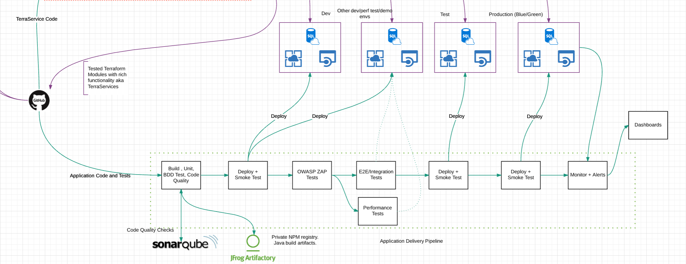

# 5. Application Delivery Pipelines

Date: 2017-09-07

## Status

Accepted

## What is Continuous Delivery?

Continuous Delivery is a software development discipline where you build software in such a way that the software can be released to production at any time.

1. You’re doing continuous delivery when: 
2. Your software is deployable throughout its lifecycle
3. Your team priorities keeping the software deployable over working on new features
4. Anybody can get fast, automated feedback on the production readiness of their systems any time somebody makes a change to them
5. You can perform push-button deployments of any version of the software to any environment on demand

You achieve continuous delivery by continuously integrating the software done by the development team, building executables, and running automated tests on those executables to detect problems. Furthermore you push the executables into increasingly production-like environments to ensure the software will work in production. To do this you use a Deployment Pipeline.

## The Deployment Pipeline

One of the challenges of an automated build and test environment is you want your build to be fast, so that you can get fast feedback, but comprehensive tests take a long time to run. A deployment pipeline is a way to deal with this by breaking up your build into stages. Each stage provides increasing confidence, usually at the cost of extra time. Early stages can find most problems yielding faster feedback, while later stages provide slower and more through probing.

## Application Requirements  

Applications should conform to the [12 Factor guidelines](https://12factor.net/) 

## Pipeline Components

### Source Code Management (Git)
Projects that are built in the open will be hosted on on Github.com in public repositories. 
Code that hasn’t been Open Sourced will be hosted on the Reform Programmes’ Github Enterprise servers. 
The SCM system will be the source of truth for application and infrastructure code.

### SonarQube

SonarQube is used for code quality scans. Each application should have a SonarQube scan as part of it’s build stage

### Artifactory

JFrog Artifactory is used to store build aretefacts. It is also used as a private NPM registry and a private Docker image registry

## Pipeline Stages

### The Build and Test stage

Source code is checked out of the mainline branch, or a working branch.

#### For Node.JS projects
1. Run npm install or yarn install to install dependencies including dev dependencies to run tests
2. Run npm lint or yarn lint. 
3. Run npm test or yarn test to run unit tests and feature tests
4. Run npm test:nsp or yarn test:nsp to run Node Security Project tests to scan for known vulnerabilities  
5. Run npm sonar-scanner or yarn sonar-scanner to run a SonarQube scan
6. Run any other tests via npm or yarn that are applicable  

#### For Java projects
1. Run a clean compile. This can be mvn clean compile ( or equivalent in gradle)
2. Run a unit test stage. This can be mvn test (or equivalent in gradle)
3. Run a SonarQube scan

### Deployment
Applications are deployed to Azure PaaS services. These are Azure Web Applications. Deployment is via a git push to the Web Application’s remote git repository. 

### Packaging projects for deployment
Web applications should use the **PORT** environment variable to configure the HTTP port to accept requests.

#### Node.JS
Node projects are not packaged, and the application is deployed as is.
Push the current commit to the remote repository hosted by the Web Application service

#### Java
Java applications are packaged as a self executing JAR. Web applications should contain an embedded web server. I.e Spring Boot, Jetty etc

### Deployment
Deployment is provided by a Jenkins library.
In the application’s Jenkins pipeline, import the *Infrastructure* library. 
See https://github.com/contino/moj-rhubarb-frontend/blob/master/Jenkinsfile for an example

### Post Deployment tests

#### Smoke Tests

The pipeline should run post deployment smoke tests.The smoke tests should ensure at a minimum the /health endpoint is accessible.
#### Integration tests
The pipeline should run any relevant integration tests

#### Security tests

In test environments the pipeline should run OWASP ZAP security tests

#### Performance tests
Performance tests should be run in a non-production environment.  It is not expected that performance tests are run as part of the pipeline build

#### Manual exploratory testing
Continuous manual exploratory testing and security testing should be done. Manual tests should not act as a quality gate in the pipeline. 

### Production Deployments

Production deployments will follow a blue/green deployment process. See [Blue/Green deployments](https://martinfowler.com/bliki/BlueGreenDeployment.html)

Database changes are not part of the blue/green deployment process, and should be considered on a case by case basis.

Azure traffic manager will be used to control traffic to Blue/Green environments.

Feature toggles will also be used to expose or hide new features. 

Each production deployment should be visualised as a line in a graph.

### Post Production Deployment Monitoring
Production application stacks should have dashboards that monitor the status of the application in production.

The dashboards should include:
1. Application health metrics
2. Product quality metrics
3. Product usage metrics to provide feedback

Each change to production should be marked as a line on dashboard graphs.

## Key Principles for the Ministry of Justice Deployment Pipelines

1. Increase confidence in quality of code
2. Reduce time to get feedback.
3. Increase confidence in the security of the applications built
4. Improve developer happiness and productivity

