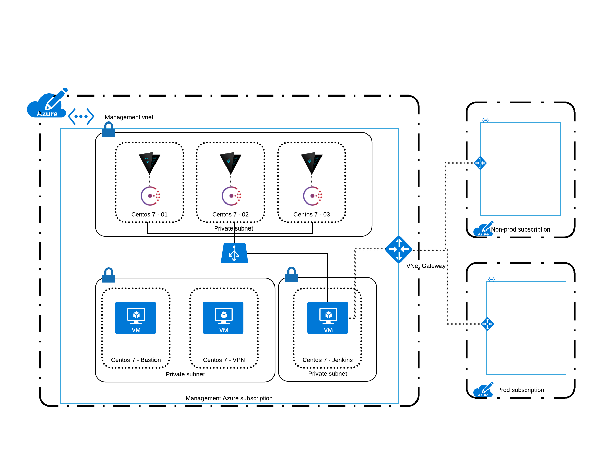

# 5. vault-cluster-architecture

Date: 2017-08-10

## Status

Proposed

## Context

Vault is a system to securely access *secrets*. A secret is anything that you want tightly control access to, such API keys for external services,
passwords, certificates and much more. As a result, any downtime of the Vault service can affect downstream clients. 

Vault is designed to support a highly available deploy to ensure a machine or process failure is minimal disruptive.

### Design Overview

Azure doesn't have a PaaS offering for Hashicorp Vault and this means that the deployment of a Vault Cluster has to be on IaaS infrastructures.

[High Level Design](https://www.lucidchart.com/documents/edit/e7aa6cd1-b63e-4f6d-a249-dd477a79000f#)

 

To be highly available, one of the Vault server nodes grabs a lock within the data store. 
The successful server node then becomes the active node; all other nodes become standby nodes. 
At this point, if the standby nodes receive a request, they will either forward the request or redirect the client depending on the current configuration and state of the cluster. 
Due to this architecture, HA does not enable increased scalability. 
In general, the bottleneck of Vault is the data store itself, not Vault core. 
For example: to increase the scalability of Vault with Consul, you would generally scale Consul instead of Vault.

Note that internal cluster communication always be forced to https since only TLS connections are used between servers. 

### Considerations

One of the aspect to consider is what benefit brings to put the vault cluster behind a load balancer in terms of security and availability.
The design above doesn't have the load balancer component as it will require a spike to get a better understanding of pros and cons.

## Decision

To enable HA currently there are several storage backends that support high availability mode, including Consul, ZooKeeper and etcd. 
 
The Consul backend is the recommended HA backend, as it is used in production by HashiCorp and its customers with commercial support.

Deployment strategy through immutable infrastructure approach offering a best stability at deployment time and resiliency in upgrade or DR situations.  
Because Vault manages sensitive data and secrets, it is of fundamental importance that we are taking a Zero Downtime deployment approach to deliver new features or upgrade the system.

## Consequences

A simple definition of immutable infrastructure is:
* Automate the setup and deployment for every part and every layer of your infrastructure.
* Never change any part of your system once it is deployed. If you need to change it, deploy a new system.

As per definition replacing a system at the lowest level you can, forces you to automate every deployment step introducing concepts like repeatability. 
Immutable infrastructure and Continuous deployment work great together. Completely replacing, instead of updating, an existing part of your infrastructure makes your deployments less complex

**Advantages to Immutable Infrastructure**
* Going back to an old version is easy, as you have the old image available.
* Every change to the infrastructure needs to be in a script. Any server can be removed at any time and will take manual changes with it.
* It is easy to have a production-like system on development machines.
* You have an incentive to speed up the time your servers need to be built.
* Setting up staging systems is easy and can be automated.
* Testing the new infrastructure in isolation is possible.

**Challenges with immutable infrastructure**

This approach also has its challenges. Especially around tooling.
* Better and standardised tooling is necessary, although new tools like Packer make it easier.
* Setting up automation for immutable infrastructure has higher costs at the beginning.
* Fixing problems is slower as you can’t just SSH into an existing server. It needs to be redeployed.
* There needs to be a way to reliably replace a server without impacting the whole system.
* Replacing databases continuously is hard, but this won't be our case.
