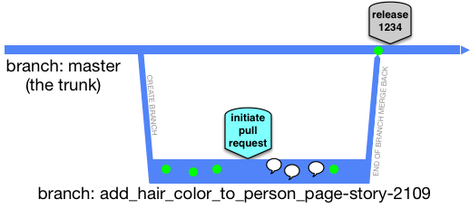

# 9. Developer Workflow for Code Changes

Date: 2017-11-10

## Status

Proposed

## Context

Adoption of the CNP brings with the ability to change and improve the developer workflow when making application code changes.  As per [5. Application Delivery Pipelines](doc/adr/0005-pipeline-design.md) the pipeline is opinionated and promotes the practice of Continuous Delivery.  This proposal goes into the detail of the expected workflow of a developer making an application change in the context of CNP using Continuous Delivery.

### What is Developer Workflow?
Developer workflow is the process developers use to create application changes and prepare them for release in a reliable manner.  This includes the branching strategies, code review, and testing, all with a heavy reliance on the pipeline.

## Decision

The following patterns are proposed in order to facilitate confident code changes with fast feedback.

### Trunk based development using short lived feature branches
Trunk based development is an enabler for Continuous Delivery via Continuous Integration.  Changes are frequently made to the master branch (trunk) whilst ensuring the master branch is always in a releasable state.  The releasable state is supported by a wide range of automated testing and development strategies for managing change such as feature toggles or branch by abstraction.

A short lived feature branch is a branch created with a specific and small change as its purpose.  The branch should live no more than a couple of days, preferably under a single day, before it is merged into master and deleted.  The merging takes place via a Pull Request in the [Github Flow](https://guides.github.com/introduction/flow/) (not to be confused with the more onerous [GitFlow](http://endoflineblog.com/gitflow-considered-harmful)).  There should be no more than one short lived feature branch per developer and are not shared.  This is easily achievable when change is small, focussed and frequently merged into master.

The master branch of each repository should be configured as a Protected Branch, thereby preventing force pushes, deletion and requiring status checks before merging.

 
_Image from [TrunkBasedDevelopment.com](https://trunkbaseddevelopment.com/short-lived-feature-branches/)_

### Use Pull Requests for code review
Code reviews are an enabler for improving code quality and knowledge sharing.  Combined with short lived feature branches, small pull requests (PR) enable fast feedback and an early opportunity to incorporate it.  

The in-built support within Github is excellent for facilitating reviews and each repository should configured to require at least one review before merge. 

The creation of a pull request will trigger a shortened pipeline.  The PR code will be applied to the master code locally on the Jenkins agent workspace, as such simulating a merge.  The shortened pipeline will then run the static checks (i.e. checks which do not require deployment to an environment).  This will include running unit tests and static analysis.  These checks, combined with a peer review, should provide enough confidence that a PR is ready for merge.  

Once a PR is merged, a full pipeline will be triggered and the integrated code will once again pass through the static checks before a deployment stage and on to the Production subscription.

### Use strategies to allow deployment to continue whilst controlling the release of changes
In a Continuous Delivery world, using short lived feature branches, ideally all changes will be small enough to fit into this process.  For the times that this is not the case, it is important to separate the action of "deploying code" from "releasing a change".  This is to allow the code to continue to be tested and deployed whilst avoiding big bang deployments.

One strategy is [Branch by Abstraction](https://martinfowler.com/bliki/BranchByAbstraction.html)".  This is a technique for making a large-scale change to a software system in gradual way that allows you to release the system regularly while the change is still in-progress.

Another strategy is [Feature Toggles](https://martinfowler.com/articles/feature-toggles.html).  At their most basic, they are flags that disable or enable code paths through an application.  There are multiple categories of feature toggles allowing for different levels of change, from experimentation to controlling a release.

### Blue/Green deployments support "no downtime deploys"

## Consequences

Consequences here...

## Recommended Reading
* [TrunkBasedDevelopment.com](http://trunkbaseddevelopment.com)
* GDS Blog post: [Easing the process of pull request reviews](https://gdstechnology.blog.gov.uk/2016/09/30/easing-the-process-of-pull-request-reviews/)
* [Organisation Pattern: Trunk based Development](https://www.continuousdeliveryconsulting.com/blog/organisation-pattern-trunk-based-development/)
* [Feature Toggles](https://martinfowler.com/articles/feature-toggles.html)
