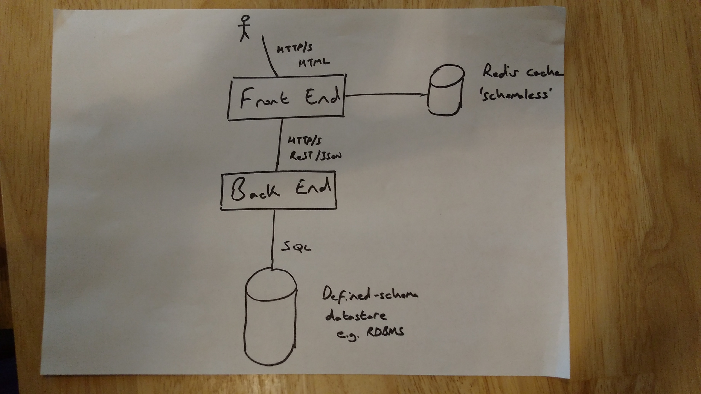
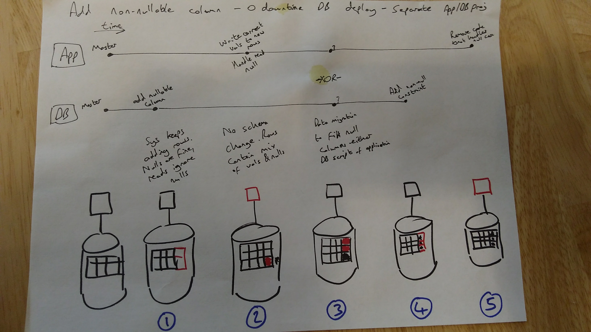

# Developer Workflow for DB Schema Changes

## Status

Proposed

## Context

Adopting a Continuous Delivery (CD) pipeline and zero-downtime deployments brings challenges, particularly regarding evolution of underlying database schemas.

From Chapter 12 Managing Data, Continuous Delivery [David Farley; Jez Humble]

> The lifecycle of application data differs from that of other parts of the system. Application data needs to be preserved—indeed, data usually outlasts the applications that were used to create and access it. Crucially, data needs to be preserved and migrated during new deployments or rollbacks of a system.

> In most cases, when we deploy new code, we can erase the previous version and wholly replace it with a new copy. In this way we can be certain of our starting position. While that option is possible for data in a few limited cases, for most real-world systems this approach is impossible. Once a system has been released into production, the data associated with it will grow, and it will have significant value in its own right. Indeed, arguably it is the most valuable part of your system. This presents problems when we need to modify either the structure or the content.

The underlying problem here is that we can't just swap a new version of the database for an old version, like we would with blue/green deployments for code, if the data in question is constantly in motion.

### What is zero-downtime deployment?

First, we need to define what zero-downtime actually means. Does it just apply to frontend services? Is it just public-facing frontend services?

To perform zero-downtime deployments of frontend applications there are two options:

* If possible, decouple frontend and backend so that frontend still provides a useful service if one of the backends is down
* Decouple database schema changes from backend deployment and perform changes in multiple, backward-compatible steps

Can the frontend tolerate downtime of backend services? Can the frontend offer reduced functionality when backends are down but still provide a useful service to users? Is the backend 'private' so that it is only accessible to frontend services? If so, then it is possible to perform zero-downtime deploys by taking the backend services down for a short time to perform DB upgrades - this enables 'traditional' database migration deployments. Note, however, that if a backend doesn't support zero-downtime deployments then it must be clearly documented so that any new consuming service knows to be appropriately decoupled.

If the frontend doesn't function without the backend or the 'backend' is also a public-facing service (API) then the backend must also support zero-downtime deployments. If the backend is backed by a defined-schema datastore e.g. an RDBMS then extra steps need to be added to the release pipeline in order to facilitate this.

### 'Traditional' database migration deployments

* Add new feature to app including a DB schema migration - this is done in-step (single repo containing code and DB update scripts, update contained in single unit of work, app will only work after migration of DB schema)
* To deploy
  * stop the application
  * apply DB schema migration scripts (usually managed through a tool such as Flyway or Liquibase)
  * start new version of the application

### Zero-downtime database deployments

To perform zero-downtime database deployments the schema migration MUST be separated from the code deployment. [Database Migrations Done Right](http://www.brunton-spall.co.uk/post/2014/05/06/database-migrations-done-right/) explains further and gives an example of the steps required when adding a non-nullable column to an existing table.

The five-step process for adding the column is shown in the diagram below.

