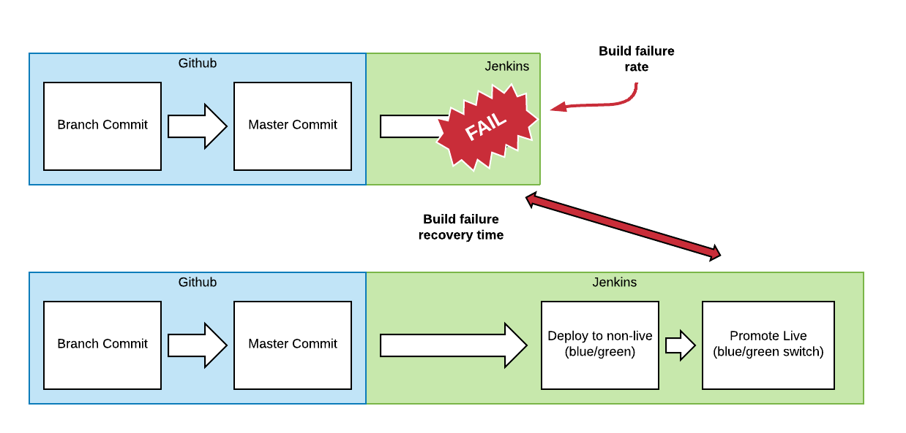

# Pipeline Metrics

## Status

Proposed

## Context
To determine the success and health of the pipeline, the following metrics will be used.

## Key Metrics

### Deployment Stability
A combination of:
* Production Deployment Failure Rate
  * Track the number of production changes which require remediation
  * Sourced from issue system at HMCTS (what is this?)
* Production Recovery Time
  * The time it takes to remediate a Production a failed change
  * Sourced from issue system at HMCTS (what is this?)

  
 
### Deployment Throughput
A combination of:
* Deployment Lead Time
  * Time from code landing on the non-live blue/green and the switch to release
  * Source: deploy to non-live and blue/green switch from jenkins (or wherever we trigger this)
* Deployment Interval
  * Time between blue/green switch releases
  * Sourced from the tool making the blue/green switch

  

### Build Stability
A combination of:
* Build Failure Rate
  * Percentage of builds that fail to reach deployment to non-live (due to compilation, testing, any checks in the pipeline)
  * Sourced from Jenkins
* Build Failure Recovery Time
  * Average time between a failed build and the next successful build that deploys to pre-release
  * Sourced from Jenkins

  

### Build Throughput
As artifacts aren’t used, we’ll approximate to the deploy to non-live of blue/green
A combination of:
* Build Lead Time
  * Time from “merge to master” to deploy to non-live, i.e. before blue/green switch
  * Sourced from Jenkins
* Build Interval
  * Time between deploys to pre-release
  * Sourced from Jenkins

  

### Mainline (master branch) Throughput
Tracks the rate at which code is committed to master - an indicator of Continuous Integration and whether code is hanging around in unmerged branches.
A combination of:
* Mainline Lead Time
  * Time between a commit and it’s merge to master
  * Sourced from github
* Mainline Interval
  * Average between master commits
  * Sourced from Github

  
