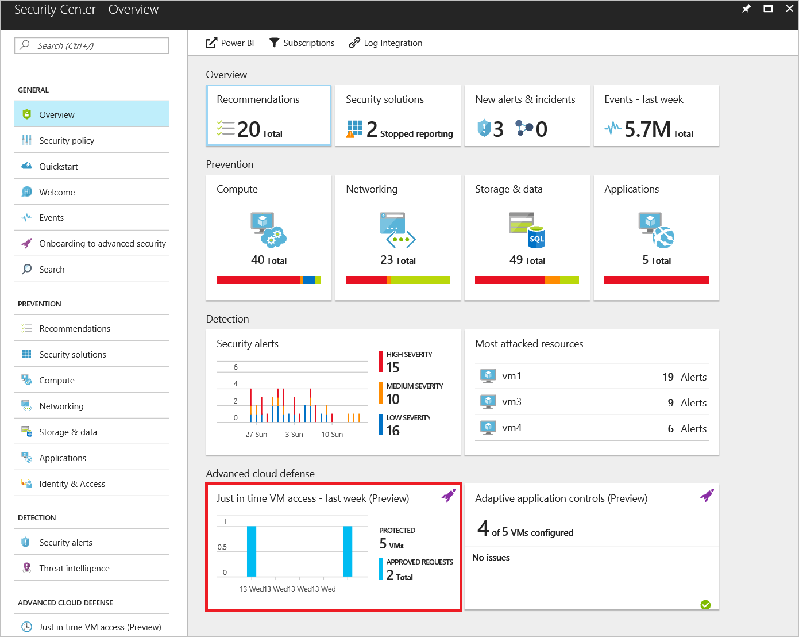
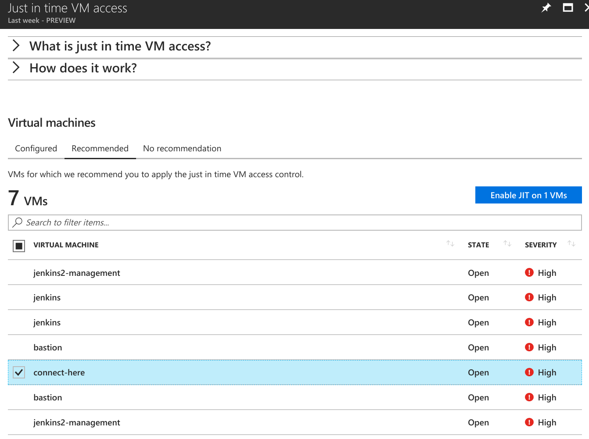
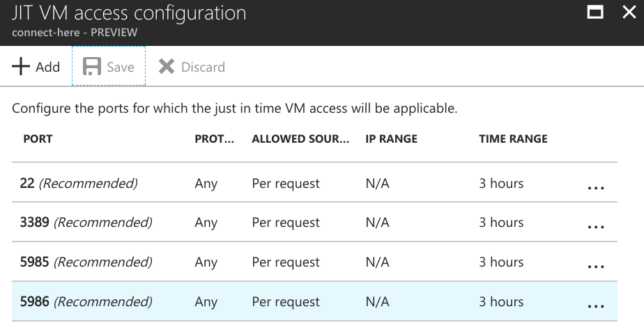
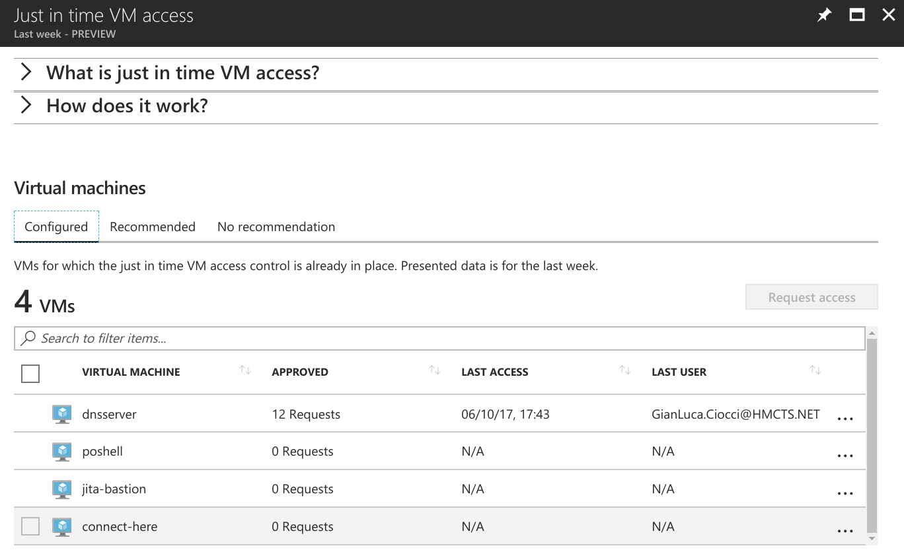
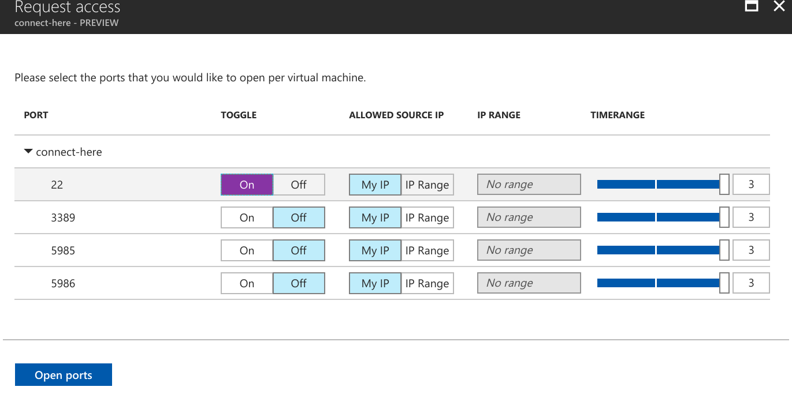

# Just in time access configuration

1.  Go to https://portal.azure.com

    Security Center -> [Just in time VM Access](https://portal.azure.com/#blade/Microsoft_Azure_Security_R3/JitNetworkAccessBlade)
    

2. In **Recommended** tab find the VM you want to enable JIT access for
    

    **Can't find it?**  Reasons that can cause a VM not to be recommended are:
    - Missing NSG - The just in time solution requires an NSG to be in place.
    - Classic VM - Security Center just in time VM access currently supports only VMs deployed through Azure Resource Manager. A classic deployment is not supported by the just in time solution.
    - Other - A VM is in this category if the just in time solution is turned off in the security policy of the subscription or the resource group, or that the VM is missing a public IP and doesn't have an NSG in place.

3. Select and click on **Enable JIT on VMs**
    
    Add/remove ports according to preference and **Save**

4. Verify **Configured** tab contains our newly added VM
    

You will still see the VM under **Recommended** tab with a *Resolved* state   

**Note:** Sometimes it takes a bit to see it under Configured tab

# Getting access to a VM via Just in time access
1. Go to https://portal.azure.com
    see [step 1](#1) above
2. Under **Configured** tab select the VM you're requesting access to
    
3. Select which ports you need opened and for how long. 
    
    You can request access only to the ports that are configured in the just in time policy. Each port has a maximum allowed time derived from the just in time policy.

# References:
- https://docs.microsoft.com/en-us/azure/security-center/security-center-just-in-time#enable-just-in-time-vm-access
